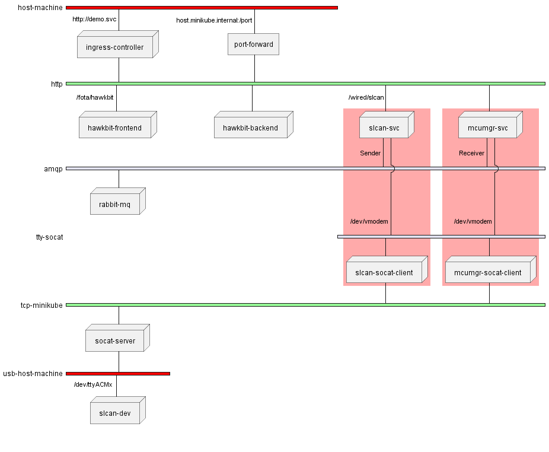

Demo Microservice Architecture
==============================

Overview
--------
``demo-svc`` is a Microservice Architecture implementation which is currently formed of the following
services and components: 

* `hawkbit-fota <https://github.com/jonathanyhliang/hawkbit-fota>`_
  
  ``hawkbit-fota`` service consists of a frontend server which provides RESTful APIs to manage images,
  distributions, and deployments to be deployed to ``hawkbit-fota`` clients. And a backend server which
  implements `Hawkbit DDI <https://www.eclipse.org/hawkbit/apis/ddi_api/>`_ compliant RESTful APIs
  so that ``hawkbit-fota`` clients could poll and launch FOTA processes.

* `slcan-svc <https://github.com/jonathanyhliang/slcan-svc>`_
  
  ``slcan-svc`` Bridging serial-line CAN communication via RESTful APIs

* `mcumgr-svc <https://github.com/jonathanyhliang/mcumgr-svc>`_

  ``mcumgr-svc`` implements a ``hawkbit-fota`` client as the frontend to retrive FOTA deployments from
  ``hawkbit-fota`` service backend by polling and launching FOTA processes. The backend of the service
    
* `rabbitmq <https://www.rabbitmq.com/kubernetes/operator/quickstart-operator.html>`_
  
  Since both ``slcan-svc`` and ``mcumgr-svc`` deal with the same serial port, an inter-service measure is
  required to make a sequencial transitioning of the interface from one to the other. ``rabbitmq`` is utilised
  here so that when ``slcan-svc`` has released the serial port and put the ``slcan`` device into firmware
  update mode, ``mcumgr-svc`` is informed to launch the update process.

