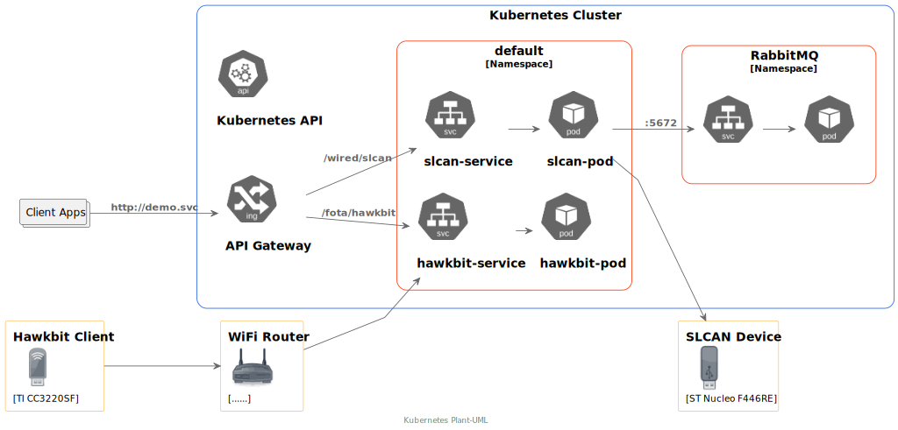

Demo Microservice Architecture
==============================

Overview
********
``demo-svc`` is a Microservice Architecture implementation which is currently formed of the following
services and components: 

* `hawkbit-fota`_
  
  ``hawkbit-fota`` service consists of a frontend server which provides RESTful APIs to manage images,
  distributions, and deployments to be deployed to ``hawkbit-fota`` clients. And a backend server which
  implements `Hawkbit DDI`_ compliant RESTful APIs so that ``hawkbit-fota`` clients could poll and launch
  FOTA processes.

* `slcan-svc`_
  
  ``slcan-svc`` service is capable of bridging serial-line CAN communication via RESTful APIs. The serial-line
  backend of the service is partially `Serial-Line CAN`_ compliant for interfacing a `slcan`_ end device.

* `mcumgr-svc`_

  ``mcumgr-svc`` implements a ``hawkbit-fota`` client as the frontend to retrive FOTA deployments from
  ``hawkbit-fota`` service backend by polling and launching FOTA processes by RESTful APIs the ``Hawkbit`` backend
  offers. The backend of ``mcumgr-svc`` implements ``upload`` and ``reset`` methods of `mcumgr`_ to update the
  firmware of the connected ``slcan`` devcice.
    
* `rabbitmq`_
  
  Since both ``slcan-svc`` and ``mcumgr-svc`` deal with the same serial port, an inter-service measure is
  required to make a sequencial transitioning of the interface from one to the other. ``rabbitmq`` is utilised
  here so that when ``slcan-svc`` has released the serial port and put the ``slcan`` device into firmware
  update mode, ``mcumgr-svc`` is informed to launch the update process.

Part of the work to demonstrate this Microservice Architecture is to develop an ``slcan`` device and a
``hawkbit-fota`` client device to interact with the Microservice. A fork of `zephyrproject-rtos/zephyr`_ has
been added with an `slcan`_ sample application which runs on `ST Nucleo F446RE`_ board, and the existing
`Hawkbit FOTA client`_ sample application has been patched to support `CC3220SF LaunchXL`_ WIFI board bring-up.

Prerequisite
************
* Raspberry Pi ARM64
* `minikube ARM64 <https://minikube.sigs.k8s.io/docs/start/>`_
* socat
* An `slcan`_ device

Building and Running
********************
Start a socat server process which listens to tcp:80 and links to the serial port of ``slcan`` device.
(/dev/ttyACM0 in this example)

.. code-block:: console

    sudo socat tcp-l:80,reuseaddr,fork file:/dev/ttyACM0,nonblock,waitlock=/var/run/ttyACM0.lock &

Enable the Ingress controller:

.. code-block:: console

    minikube addons enable ingress

Install the RabbitMQ Cluster Operator:

.. code-block:: console

    kubectl apply -f "https://github.com/rabbitmq/cluster-operator/releases/latest/download/cluster-operator.yml"

Create a RabbitMQ Cluster. It could take serveral minutes for RabbitMQ Cluster to get ready.

.. code-block:: console

    kubectl apply -f demo-svc-rabbitmq.yaml

Create a ``hawkbit`` deployment. This deploys a pod that ``hawkbit-svc`` is running on,
and a servie that expsoe the frontend and backend ports. ``mcrmgr-svc`` depends on the
backend port of ``hawkbit-svc`` exposed.

.. code-block:: console

    kubectl apply -f demo-svc-hawkbit.yaml

Create an ``slcan`` deployment. This deploys an ``slcan-svc`` and an ``mcumgr-svc``
Wait until both ``slcan-svc`` and ``mcumgr-svc`` are in running state

.. code-block:: console

    kubectl apply -f demo-svc-slcan.yaml

Try retriving an ``slcan`` message by:

.. code-block:: console

    curl --resolve "demo.svc:80:$( minikube ip )" \
          -i http://demo.svc/wired/slcan/123 \
          -H "Content-Type: application/json" \
          -X "GET"

API Documentation
*****************
`hawkbit-fota`_ and `slcan-svc`_ maintain their API documentation using `Swagger UI`_.

References
**********
* `Set up Ingress on Minikube with the NGINX Ingress Controller <https://kubernetes.io/docs/tasks/access-application-cluster/ingress-minikube/>`_
* `RabbitMQ Cluster Kubernetes Operator Quickstart <https://www.rabbitmq.com/kubernetes/operator/quickstart-operator.html>`_

.. _hawkbit-fota: https://github.com/jonathanyhliang/hawkbit-fota
.. _Hawkbit DDI: https://www.eclipse.org/hawkbit/apis/ddi_api/
.. _slcan-svc: https://github.com/jonathanyhliang/slcan-svc
.. _Serial-Line CAN: https://github.com/torvalds/linux/blob/master/drivers/net/can/slcan/slcan-core.c
.. _slcan: https://github.com/jonathanyhliang/zephyr/tree/slcan/samples/subsys/canbus/slcan
.. _mcumgr-svc: https://github.com/jonathanyhliang/mcumgr-svc
.. _rabbitmq: https://www.rabbitmq.com/kubernetes/operator/quickstart-operator.html
.. _zephyrproject-rtos/zephyr: https://github.com/jonathanyhliang/zephyr
.. _ST Nucleo F446RE: https://docs.zephyrproject.org/latest/boards/arm/nucleo_f446re/doc/index.html
.. _Hawkbit FOTA client: https://github.com/jonathanyhliang/zephyr/tree/cc32xx-hawkbit-bringup/samples/subsys/mgmt/hawkbit
.. _CC3220SF LaunchXL: https://docs.zephyrproject.org/latest/boards/arm/cc3220sf_launchxl/doc/index.html
.. _mcumgr: https://github.com/apache/mynewt-mcumgr
.. _Swagger UI: https://github.com/swaggo/swag
